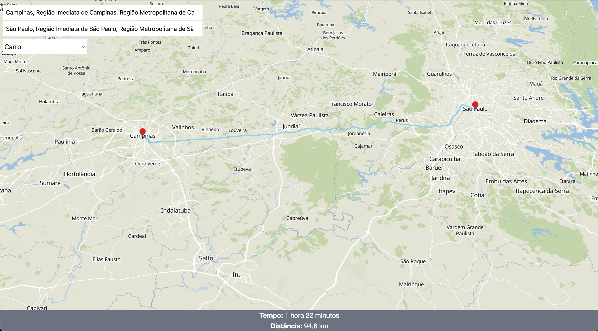
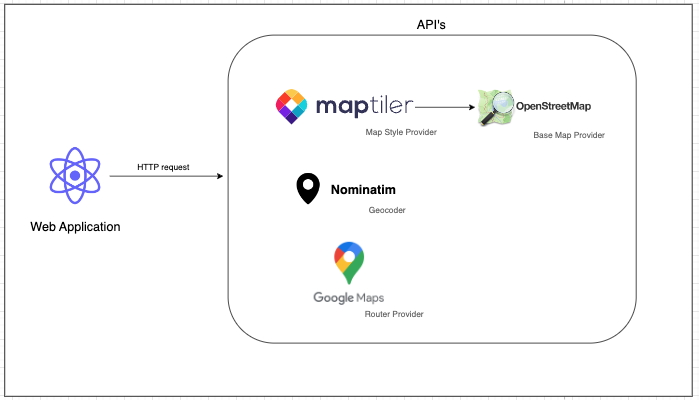
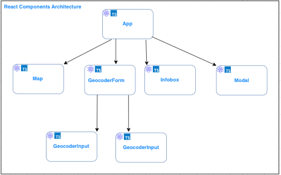

# Map Router

This project is a example of a router application. It will be provided the best route between two locations.

It using libraries such as Mapbox and Maplibre to render the map. Google Maps API to provide the best route and a open source Geocoder using Nominatim.

As commented above, this app wil provide a example of:

- Geocoder: The component to search locations and provide the lat/lng of area. It will be using a Open Source API called `Nominatim`.
- Router: It will be provided the best route between two locations, using the Google Maps API.
- Modal (Travel mode): It can choose between the traveling mode (Also google provider).
  - Bike
  - Car
  - Walk
- Duration and Distance of route

Article: https://dev.to/kevin-uehara/creating-geographic-solutions-with-maps-in-frontend-english-version-2n3j




## Service Architecture



## React Components Architecture



## Environments

It should create a `.env` file with bellow api keys

| Environment           | Description                                   |
| --------------------- | --------------------------------------------- |
| VITE_MAPTILER_API_KEY | API Key of Maptiler to provide the map style  |
| VITE_GOOGLE_API_KEY   | API Key of Goolgle Maps to provide the routes |

## Pre-requisites

- Node
- Yarn or NPM

## How to run?

1. Install dependencies

```sh
yarn
```

or

```sh
npm install
```

2. Running the project

```sh
yarn dev
```

or

```sh
npm run dev
```

## About Project

It will be using some tools:

- Vite: frontend tooling
- Tailwind: styling
- Google Maps API: router
- MapTiler: map style provider
- React Map GL: maps component
- Mapbox/Maplibre: Map client
- Nominatim: Geocoder
